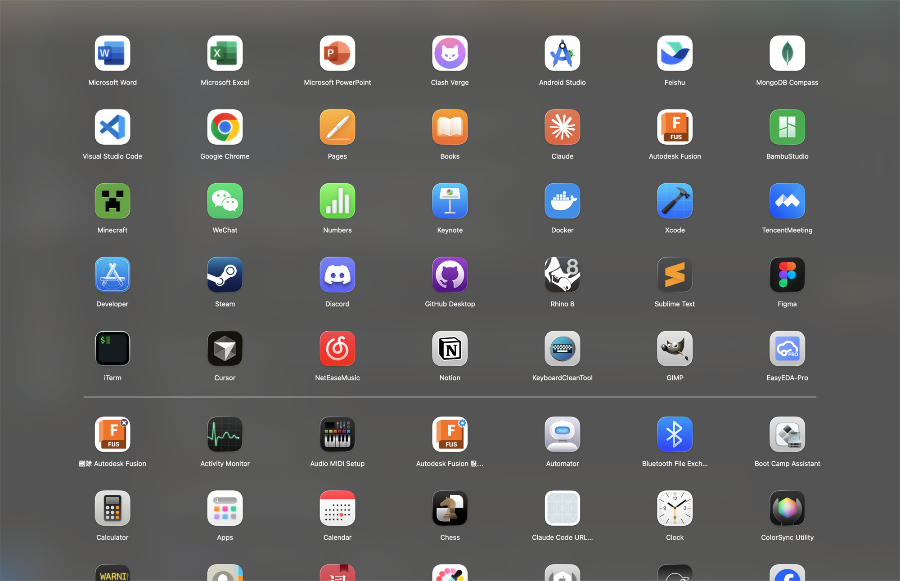

# suparpad

**Bring back Launchpad on macOS Tahoe — pinch to open, drag to organize.**

macOS 26 (Tahoe) removed Launchpad and replaced it with the Spotlight "Apps"
view, which drops the trackpad pinch gesture and won't keep a custom app
arrangement. **suparpad** is a small, from-scratch, native replacement: a
full-screen app grid you summon with a pinch and organize by dragging — with
your layout saved for good.

It does **not** patch the system, swap Apple binaries, or require disabling
SIP. It's a normal app built entirely on public frameworks, save for one
isolated private API used to read the trackpad pinch.



## Features

- **Pinch to summon.** A 3- or 4-finger pinch-closed opens the grid over a
  blurred wallpaper; pinch-open, `Esc`, or a click dismisses it.
- **Show Desktop, restored.** Pinch-open when nothing's on screen shows the
  desktop; pinch-closed brings your windows back — the classic gesture Tahoe
  dropped.
- **Two sections.** A curated **top** for the apps you actually use and a
  **dump** below, split by a divider. New apps land in the dump; drag the
  keepers up.
- **Drag to organize.** Reorder within and across sections with live reflow;
  your layout persists across restarts and app updates.
- **Stays out of the way.** Menu-bar item (no Dock icon), launch at login,
  opens on whichever monitor your cursor is on.
- **No search bar, by design** — `⌘Space` Spotlight already does search.

## Requirements

- Apple Silicon Mac
- macOS 26 (Tahoe) or later (built and tested on 26.6, arm64)
- Xcode command-line tools / a Swift 6 toolchain (to build from source)

## Install

suparpad isn't distributed as a signed download — you build it from source:

```sh
git clone https://github.com/arthurjis/suparpad.git
cd suparpad
./scripts/make-app.sh --install
```

`make-app.sh --install` builds a release `suparpad.app`, copies it to
`/Applications`, and registers a launch-at-login agent so it starts with your
Mac. It logs to `~/Library/Logs/suparpad.log`.

### Grant Input Monitoring

The first time you pinch, macOS will ask for **Input Monitoring** permission
(System Settings → Privacy & Security → Input Monitoring) — suparpad needs it
to detect the trackpad pinch globally. Enable suparpad there and pinch again.

## Gestures & shortcuts

| Action | Result |
| --- | --- |
| Pinch closed (3–4 fingers) | Open suparpad |
| Pinch open, panel visible | Dismiss |
| Pinch open, nothing on screen | Show Desktop |
| Pinch closed, desktop shown | Restore windows |
| Click an app | Launch it and dismiss |
| Drag an app | Reorder; drag across the divider to promote/demote |
| `Esc` | Dismiss (or cancel an in-progress drag) |
| Menu-bar icon | Show Launchpad / Quit |

## How it works

- **Swift + SwiftUI** for the grid and panel; **AppKit** for the borderless
  full-screen panel, window level, and menu-bar item.
- **`pinchkit`** is a tiny C library over the private `MultitouchSupport`
  framework. It reads raw trackpad touch frames and runs a pinch detector
  whose thresholds were tuned from real captured gestures (fast + slow paths,
  a refractory window, and rejection of scrolls/swipes). This is the *only*
  private API in the project; it's confined to this one file.
- **No system modification.** Unlike Dock-binary-swap approaches, suparpad
  changes nothing on the system volume and never asks you to disable SIP.
- **Swift Package Manager only** — there is no Xcode project.

## Development

```sh
swift build                 # build all targets
.build/debug/suparpad       # run the app directly (dev loop)
scripts/devshot.sh          # launch, screenshot the panel, print the PNG path
.build/debug/pinchprobe 15  # raw trackpad touch logger, for tuning the detector
```

While developing, `pkill -x suparpad` first (a debug build and the installed
app would otherwise both grab the gesture), and restore the installed one with
`launchctl kickstart gui/$UID/com.arthur.suparpad`.

Layout of the repo:

```
Sources/suparpad    the app (grid, gestures, window, menu bar)
Sources/pinchkit    pinch-detection C library (MultitouchSupport)
Sources/pinchprobe  standalone touch logger / detector spike
scripts/            build (make-app.sh) and dev (devshot.sh) helpers
SCOPE.md            design decisions and what's intentionally out of scope
```

## Contributing

Contributions are welcome — open an issue or a pull request. Please keep the
project native and public-API-first (no SIP changes, no code injection), and
keep the pinch/private-API surface confined to `pinchkit`.

Known limitations and good first ideas:

- **The app list only refreshes at launch.** Apps installed or removed while
  suparpad is running don't appear/disappear until it restarts (which happens
  at login; or quit it from the menu bar — the launch agent revives it). A
  rescan-on-open with a cheap diff, or an FSEvents watcher on the scan roots,
  would fix this.
- **Auto-scroll while dragging** near a screen edge (SwiftUI's drag system
  makes this awkward; likely needs an AppKit scroll layer).
- **F4 / configurable hotkey** as an alternate trigger.
- **Folders** and Intel support are currently out of scope but reasonable
  proposals.

## Uninstall

```sh
launchctl bootout gui/$UID/com.arthur.suparpad
rm -f ~/Library/LaunchAgents/com.arthur.suparpad.plist
rm -rf /Applications/suparpad.app
rm -rf ~/Library/Application\ Support/suparpad   # forget your layout
```

## License

[MIT](LICENSE) © 2026 arthurjis. Not affiliated with Apple.
